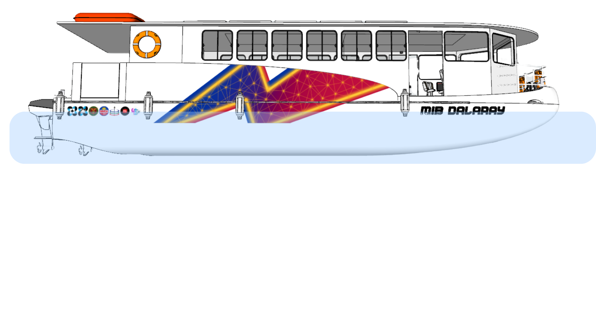
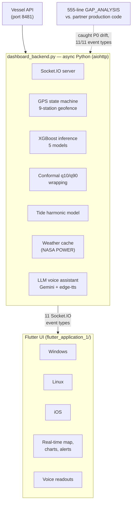

# M/B Dalaray — Operator Dashboard

Multi-platform **Flutter operator dashboard** (Windows / Linux / iOS) backed by an **async Python Socket.IO server** for the M/B Dalaray electric ferry on the Pasig River. Part of the M/B Dalaray Digital Shadow thesis project (UP Diliman, EEEI Power Electronics Laboratory).



## What it does

Live operator UI streaming **11 Socket.IO event types** from the vessel's onboard backend: real-time SOC, motor & battery anomaly alerts (with conformal-prediction intervals from the [Ferry Digital Shadow](#related-repos) XGBoost models), GPS position with **200 m geofencing across 9 Pasig River stations** (Napindan, Guadalupe, Hulo, Valenzuela, Lambingan, Sta Ana, PUP, Quinta, Escolta), tide-corrected ETA, and an LLM voice assistant.

**Deployed as `dalaray-dashboard.service` on the vessel's onboard computer.** Replay infrastructure makes the demo reproducible offline.

## Stack

- **Backend:** Python 3.12, `python-socketio` + `aiohttp`, async I/O
- **Frontend:** Flutter (Dart) — single codebase targeting Windows, Linux, iOS
- **ML inference:** XGBoost models with conformal `predict_interval()` calls (from sibling Ferry repo)
- **Voice assistant:** `google-genai` (Gemini) + `edge-tts`
- **Networking:** REST + WebSocket (Socket.IO over HTTP)
- **Deploy:** systemd unit (`dalaray-dashboard.service`)

## Architecture



## Configuration

All vessel / network endpoints are **CLI args** with placeholder defaults. Set them per environment:

```bash
python dashboard_backend.py \
  --vessel-host CONFIGURE_VESSEL_HOST \
  --port 5000
```

For the XGBoost edge bundle, point `RPI5_BUNDLE_DIR` (env var) at your local clone of [Ferry Digital Shadow](#related-repos), or place the Ferry repo as a sibling of this one (default fallback path: `../Ferry_Digital_Shadow/Models/rpi5_bundle/`).

For the LLM voice assistant, add `GEMINI_API_KEY=…` to a local file `local_keys.env` (gitignored).

## Quick start

```bash
# Backend
python -m venv venv
source venv/bin/activate                    # Windows: venv\Scripts\activate
pip install -r requirements.txt
python dashboard_backend.py                 # uses defaults; override with --vessel-host

# Flutter app
cd flutter_application_1
flutter pub get
flutter run -d windows                      # or linux, ios
```

For deterministic demos without a live vessel:
```bash
python replay_server.py                     # plays back a recorded session
```

## GAP_ANALYSIS

[`GAP_ANALYSIS.md`](GAP_ANALYSIS.md) (555 lines) — diff between this dev backend and the partner-team production code. Identifies P0 / P1 / P2 / P3 spec drift across all 11 Socket.IO event types — missing tide features, wrong cumulative km distances, wrong HV battery capacity (136 vs correct 160 kWh), etc. Useful for understanding integration trade-offs.

## Related repos

- **[daluyan-backend](https://github.com/FreddieJr-stud/daluyan-backend)** — async FastAPI + Polars + DuckDB pipeline that produces the trip segments this dashboard consumes.
- **Ferry Digital Shadow** *(publishing)* — 5 production XGBoost models (Trip SOC 0.687 % MAE, Realtime SOC 0.325 % MAE, Motor anomaly 96.4 % / 0.58 % FPR, Battery anomaly 100 % detection) + Raspberry Pi 5 ARM64 edge bundle.

## Status

Active thesis project (UP Diliman, EEEI). Manuscript and supporting code to be published with IEEE conference paper (examiner submission May 2026).

## Authors

Freddie Jr. R. Pagtulingan & S. N. B. Morales · Adviser: Lew Andrew R. Tria
Power Electronics Laboratory, EEEI, UP Diliman
